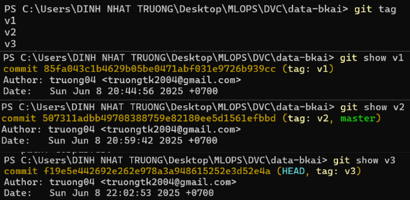
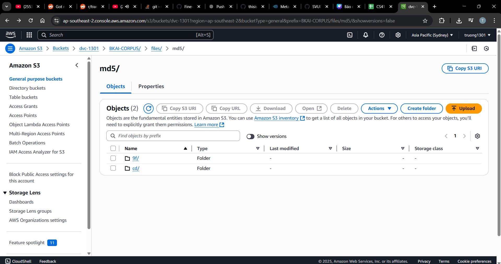
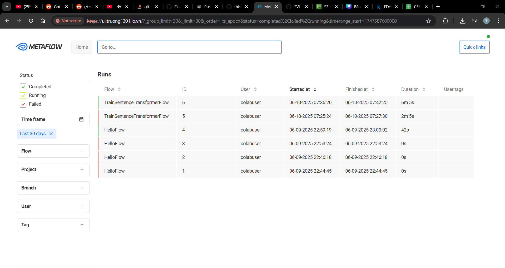
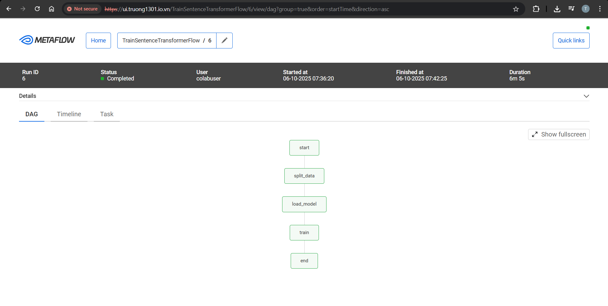
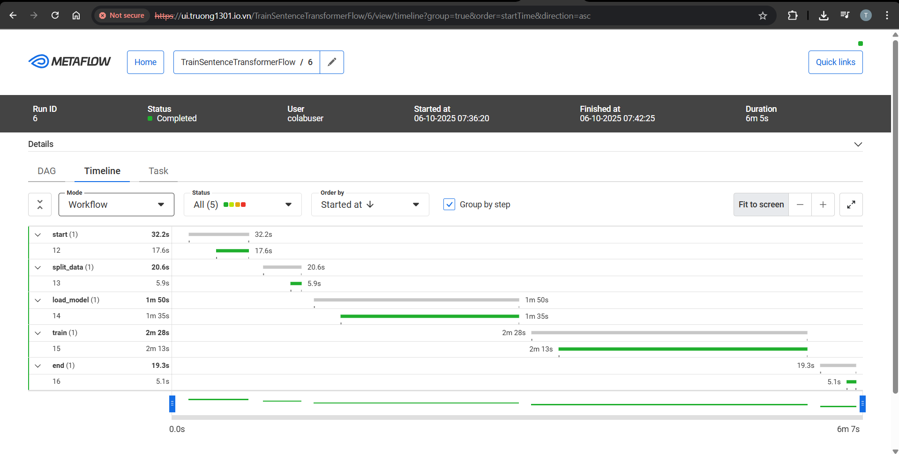
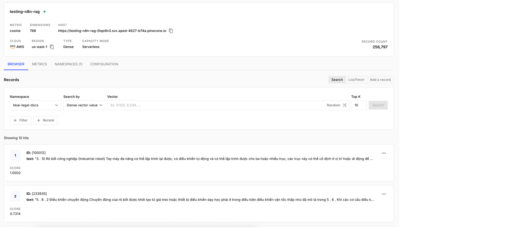
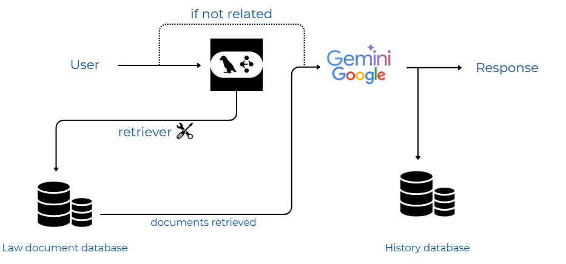
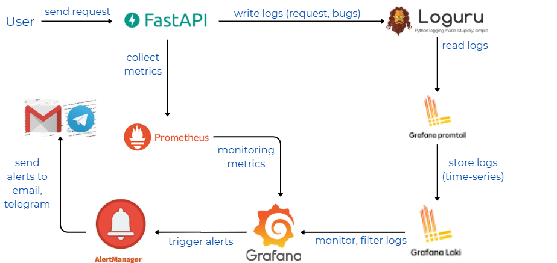

# Legal Docs Project

This repository focuses on applying MLOps tools to manage, deploy, and integrate a retrieval system (BI ENCODER + CROSS ENCODER) with RAG (Retrieval-Augmented Generation) and agent-based architectures.
Here is our demo

https://github.com/user-attachments/assets/7b16e04c-95a8-426c-83fc-3210ba28194e

# DATA LAKE AND DATA VERSION CONTROL

Before fine-tuning the model, we need to carefully preprocess the dataset, as the cross-encoder used in the reranking stage is highly sensitive to the quality and format of the input text. Any inconsistency in the preprocessing step can lead to performance degradation during training and inference.
To address this, we use DVC (Data Version Control) to manage and track changes in our datasets over time. DVC allows us to maintain a consistent versioning system for data, ensuring reproducibility across experiments. We integrate DVC with AWS S3 Bucket as the remote storage backend, which enables seamless collaboration and access to different versions of the dataset across team members and environmen

  

  DVC command line

  

   AWS S3 BUCKET UI

# HYPERPARAM TUNNING

Hyperparameter tracking is often overlooked or done manually, which can lead to errors and loss of important information. To address this, we use Metaflow to log and monitor workflows and experiments. Our team deployed Metaflow on an AWS server to allow easy access and collaboration. Additionally, we purchased a custom domain from Vinahost to host the Metaflow UI for convenient access from anywhere.

Here are some demo metaflow ui image

    

  METAFLOW  WorkFlow

    

  Metaflow DAG

    

  Metaflow timeline

# VECTOR DATABASE
Pinecone is a vector database optimized for storing and retrieving embedding vectors along with their metadata. Its strong focus on vector operations makes it ideal for such use cases. Pinecone also offers a user-friendly interface, intuitive API, and a simple setup process with minimal configuration required.

    

  PINECONE vector store management

# AGENT PIPELINE

The chatbot agent is built in two main phases:
- **Graph construction**: defining nodes and edges, where nodes are tools or custom functions.  
- **Tool development**: creating tools that the agent will call during execution (not by the user). This requires programming and algorithmic knowledge.

For the legal document chatbot, three core tools were developed:
- **Retriever Tool**: queries legal documents via embedding models and a vector database.  
- **Add Memory Tool**: stores user conversation history (with consent) for future training.  
- **Retrieve Memory Tool**: retrieves past conversations to provide personalized responses.

    

  AGENT pipeline

# MONITORING AND LOGGING
The diagram illustrates the architecture of a monitoring and logging system for a Chatbot Agent. When a user sends a request to the FastAPI server, it processes the request and logs key information (e.g., content, errors, response time) using Loguru. Promtail collects these logs and sends them to Loki, where they can be queried and visualized through Grafana. At the same time, FastAPI exposes metrics such as response time, request count, and model confidence, which are collected by Prometheus. Grafana provides a dashboard to visualize both logs and metrics. If anomalies are detected (e.g., high error rates, slow responses, low confidence), Alertmanager triggers alerts via email or Telegram. This system ensures the chatbot operates reliably, is easy to monitor, and scalable.

    

  MONITORING AND LOGGING pipeline

